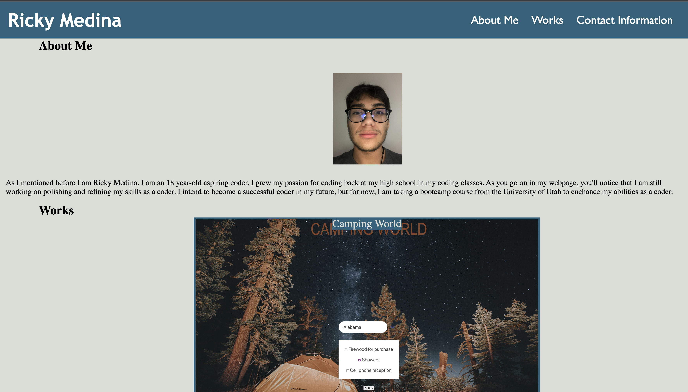
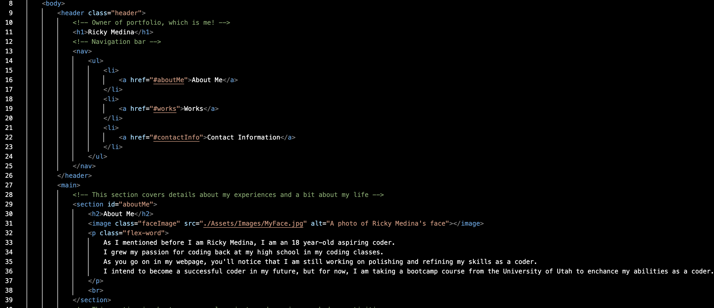
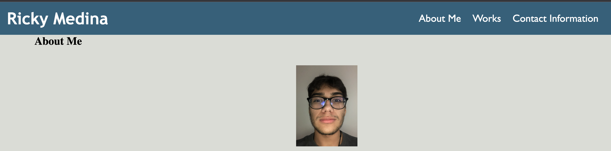
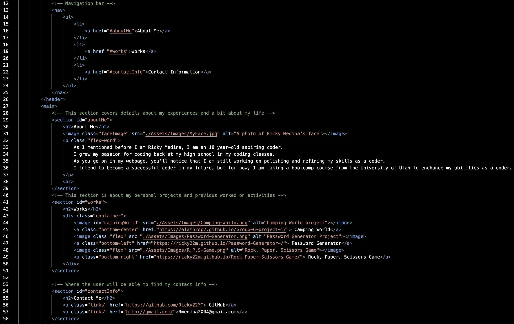

# My-Portfolio
)
Welcome, here you will find my portfolio which will include some small details about me and my life, the projects I've worked on, as well as a contact form used to get the user contact information sent directly to me.

## Objectives
Steps to proceed with: Step 1, the user is presented with the developer's name, a recent photo of the developer, and links to each section of my page: about me, works, contact me sections. Step 2, when the user clicks on one of the links in the navigation bar, they will then be directed to the correct section according to which link they clicked on. Step 3, when the user clicks on one of the projects in the portfolio, then the user will be directed to the corresponding project they had previously clicked on. Step 4, when the user navigates to the "Works" section, then the first project should appear larger than the rest of the other projects. Step 5, when the user clicks on the image to one of the projects, then the user will be directed to the corresponding project they had previously clicked on. Step 6, if the user decides to change the size of the screen while on the portfolio HTML, then the user will be presented with a responsive layout that adapts to their viewpoint.

## Step 1

In the first image you can see the code in the HTMl which will show the user the first step of creating this project. Now, in the second image we can see that the developer's name, a picture of the developer, and sections to the HTML are being provided.

## Step 2

At the top of this image we are introduced to the navigation bar. In the navigation bar, we are able to see that each section is labeled in the navigation bar as well as linked with the "Id" tags in each section of the HTML.

## Step 3

image pathway
