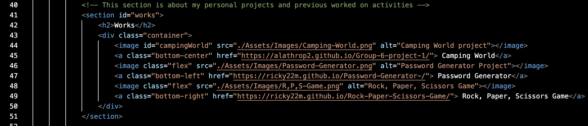
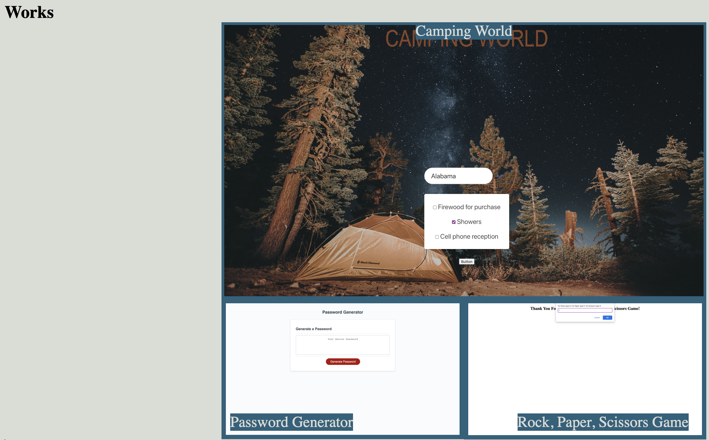
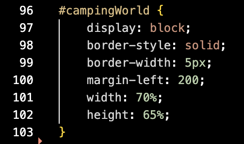
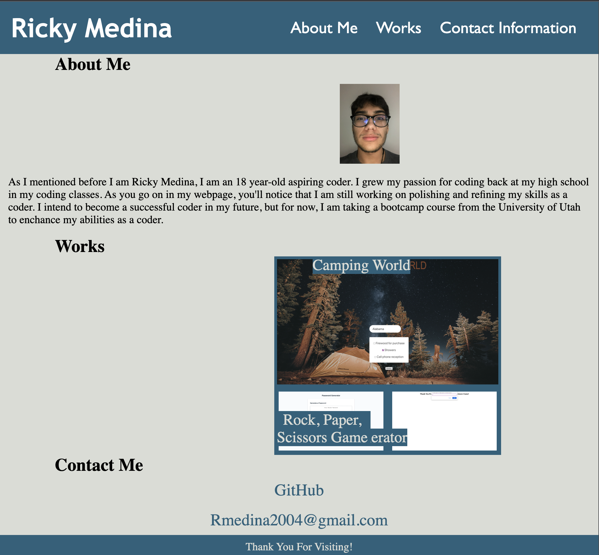
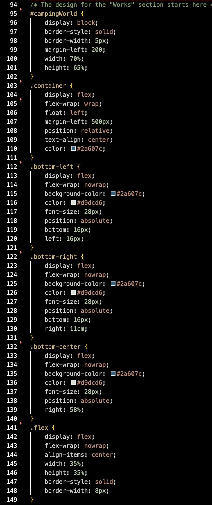

# My-Portfolio
)
Welcome, here you will find my portfolio which will include some small details about me and my life, the projects I've worked on, as well as a contact form used to get the user contact information sent directly to me.

## Objectives
Steps to proceed with: Step 1, the user is presented with the developer's name, a recent photo of the developer, and links to each section of my page: about me, works, contact me sections. Step 2, when the user clicks on one of the links in the navigation bar, they will then be directed to the correct section according to which link they clicked on. Step 3, when the user clicks on one of the projects in the portfolio, then the user will be directed to the corresponding project they had previously clicked on. Step 4, when the user navigates to the "Works" section, then the first project should appear larger than the rest of the other projects. Step 5, when the user clicks on the image to one of the projects, then the user will be directed to the corresponding project they had previously clicked on. Step 6, if the user decides to change the size of the screen while on the portfolio HTML, then the user will be presented with a responsive layout that adapts to their viewpoint.

## Step 1

In the first image you can see the code in the HTMl which will show the user the first step of creating this project. Now, in the second image we can see that the developer's name, a picture of the developer, and sections to the HTML are being provided.

## Step 2

At the top of this image we are introduced to the navigation bar. In the navigation bar, we are able to see that each section is labeled in the navigation bar as well as linked with the "Id" tags in each section of the HTML.

## Step 3 & 4

As you can see in this code, the user will be able to click on the image and the user will then be sent to the deployed project they had previously selected/clicked. The second image is of what the step three looks like in the user's perspective. Also in the second image we are able to see that the first project is larger than the other two projects.

Now on step four, the way I completed this was by uing the first project as an image and adjusting that image size that would be larger than the other two project images.

## Step 5

As you can see in the first image, the user will be able to click on the image and will be redirected to the projects that they have clicked on. On the second image you can see that each image is label with their project name as well as being able to be a clickable link which leads the user to the creator's project.

## Step 6

Now at step six, I am unfortunately able to profect the some of the use of flex code in CSS. I am able to get mostly everything to resize execept a few things. In the second image we can see the code that I used to try and resize the screen with the content within the HTML.